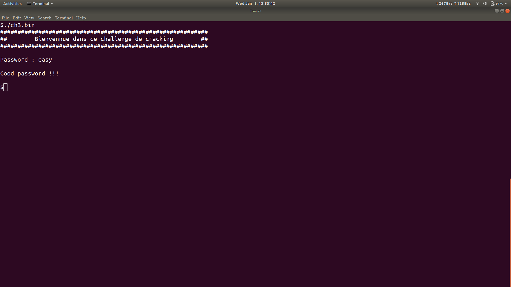

# ch1.zip
---------

After unzipping the given file we get a binary **"ch1.bin"**. Let's run the file in **gdb**.

>As you can see in **main+17** some value is getting moved into *ebp-0x8*. Later the same value is moved into eax in line *main+86* for use in the strcmp function. So let's look what **0x8048841** is in string format.So after doing **x/s 0x8048841** we find that the value is **"123456789"**. So let us enter this as the password for the binary. 

> It gets accepted and gives the flag **123456789!**

# ch3.bin
----------

>Let's run the given binary in gdb right away. The first thing that we see is that ptrace is being used so we won't be able to run the program in a debugger. Also like in the last binary in **main+17** a value is being wrote into *ebp-0xc*. So let us look what it is by doing **x/s 0x80c2888** which gives us a string *ksuiealohgy*. 

>In this picture you can see 4 comparisons are being made and the control jumps to **main+244** if they are not equal. In main+244 the message saying the input is wrong is displayed and then it's the function epilogue. Now let's see what are the values that are actually put into al and dl respectively. So we can see in **main+174** 0x4 is added to eax and then byte ptr of eax is moved into al. So what will be the byte ptr of eax. So it will be effectively the fifth letter of the string ksuiealohgy which is **e**. So what it is actually doing is it takes each of the letters of our input and then compares it to some specific letters in the string *ksuiealohgy*. So if we continue down you can see byte ptr ebp-0x15,ebp-0x14 and ebp-0x13 are moved into dl. These are the letters of our input. Now we can eax is added by 0x5,0x1 and then 0xa in the coming comparisons and then byte ptr eax is moved into al. So if we see what these letters are we will get the password to be ***easy***. So let us insert this as the password and we will get the output ***Good password !!!***

