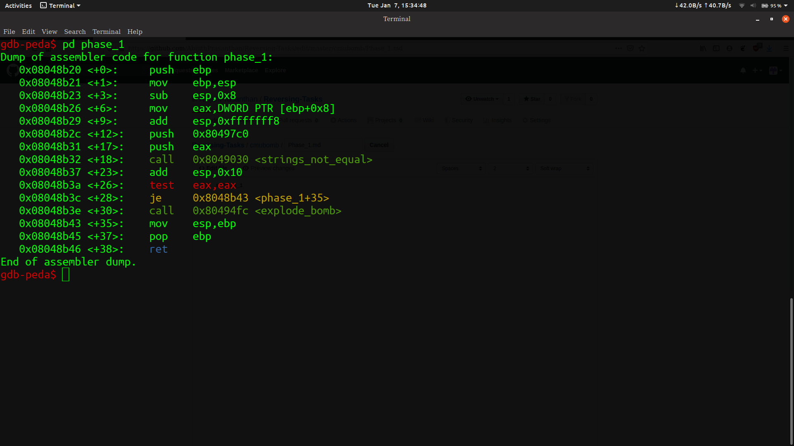

# PHASE_1

> Running the file in gdb we can see that a hex value(0x80497c0) is being pushed into the stack.

> If we run x/s 0x80497c0 we can see that it translates into **Public speaking is very easy.**. So let's try this as the password for the file which gets accepted as the password and tells the phase is defused.
