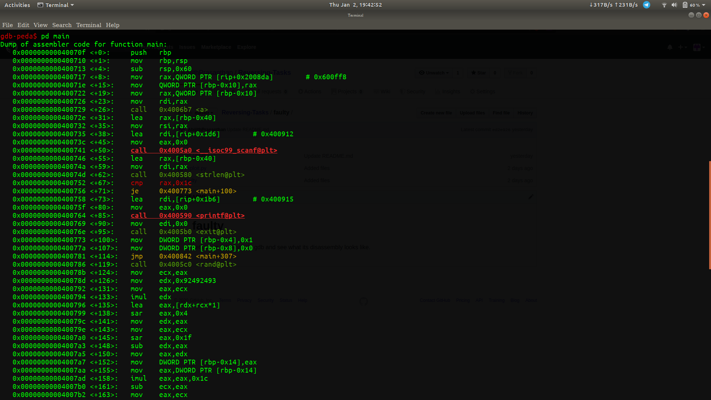

# faulty 

Let us run the [binary](https://github.com/AbijithPrasanthan/Reversing-Tasks/blob/master/faulty/faulty) in gdb and see what its disassembly looks like. 

>So first up a function **a** is called. What the function basically does is check if the program is being run in any kind of debugger. Next we can see that a call is being made to **strlen** at *main+62* after which a comparison is made between the length of the entered string and **0x1c** which is ***28***. So this means our input must be 28 letters in length.
